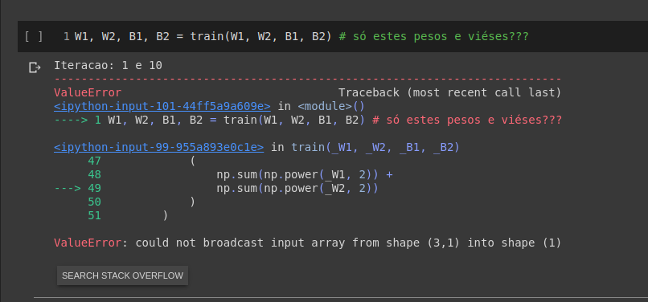

## Merchant Guide to Galaxy
Solution capable of calculating values of roman numbers and metals.

For run the solution is necessary node version >= 10.21

### `yarn start`

Runs the app 

### `yarn test`

Launches the test runner in the interactive watch mode. 
See the section about [running tests](https://jestjs.io/docs/en/getting-started) for more information.

See coverage tests in folder `coverage` after run the command <b>yarn test</b>.

<h4 align="center">
 
</h4>